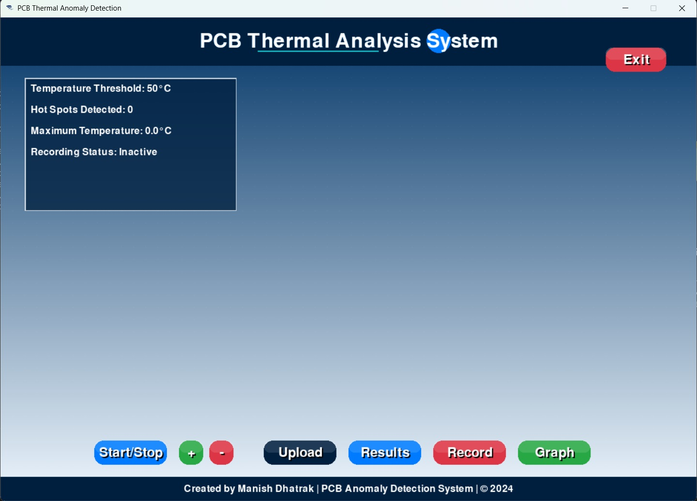
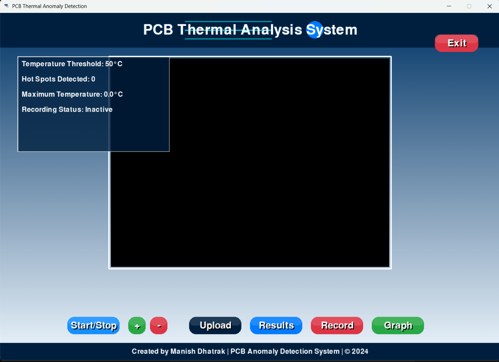
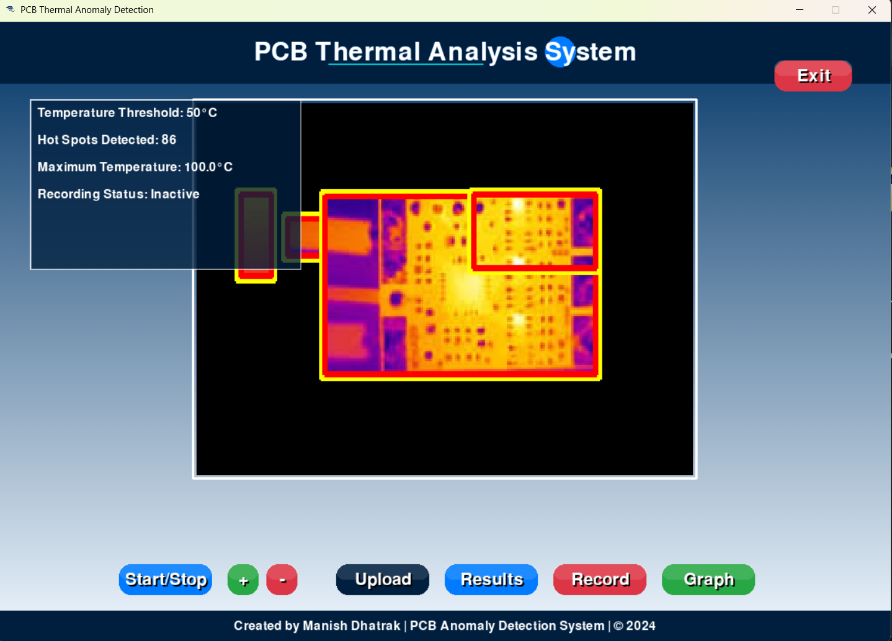
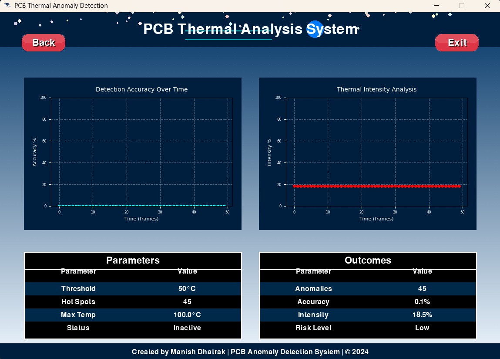

# 🌡️🔍 **PCB Thermal Anomaly Detection System** 🔍🌡️

Welcome to the **PCB Thermal Anomaly Detection System**! This project allows for real-time thermal imaging analysis of printed circuit boards, highlighting hotspots and saving captured images to help streamline manufacturing efficiency by identifying overheated components with precision. 🚀

---

## 📖 **Features** 📖

- **Real-Time Anomaly Detection**: Automatically highlights overheating areas on PCBs with visual markers. 🔴🟡
- **Customizable Temperature Thresholds**: Adjust and monitor threshold settings for precise control over what qualifies as a ‘hot spot’. 🔥
- **Automatic Snapshot & Storage**: Captures and saves images of detected anomalies in a dedicated folder. 🖼️
- **User Interface**: A modern, responsive Pygame interface with interactive animations and sleek design. 🖥️✨
- **Accuracy and Intensity Graphs**: View live accuracy and thermal intensity metrics for consistent monitoring! 📈📊

---

## 🖼️ **Screenshots** 🖼️

### Main Interface


### Welcome Screen


### Real-Time Thermal Video Mode


### Thermal Tracking Results


### Detection Accuracy and Intensity Graphs


---

## 🚀 **Getting Started** 🚀

### 🧩 Prerequisites 🧩

- **Python**: Ensure Python 3.6+ is installed 🐍.
- **Dependencies**:
  - Install required packages via `pip`:
  - Or you can instal by running the requirements.txt file
    ```bash
    pip install numpy opencv-python pygame matplotlib
    ```
- **USB Thermal Camera**: Compatible with FLIR or Seek Thermal, connected via USB. 🔌📷

---

### 📂 **Setup Instructions** 📂

1. **Clone the Repository** 📂:
    ```bash
    git clone https://github.com/astromanu007/PCB_Anomaly_Detection.git
    cd PCB_Anomaly_Detection
    ```
### 2. Project Structure 📁
```plaintext
PCB_Anomaly_Detection/
├── assets/                     # Folder for static assets like icons and images
│   ├── thermal_icon.png
│   └── creator_photo.jpg
├── sample_images/              # Folder with sample PCB images for uploading
├── anomaly_captures/           # Folder where captured anomalies are stored
├── images/                     # Folder with screenshots for README
│   ├── MAIN.jpg
│   ├── INTRO.png
│   ├── VIDEO_MODE.png
│   ├── LIVE_TRACKING_RESULTS.png
│   └── GRAPHS.jpg
├── main.py                     # Main application code for running the PCB Thermal Anomaly Detection System
└── README.md                   # Project README file with detailed documentation
```

3. **Run the Application** 🚀:
```bash
python main.py
```
## 🎮 User Interface Controls 🎮

- **🟢 Start/Stop**: Toggle real-time monitoring.
- **🎚️ Threshold Adjustment**: Fine-tune temperature sensitivity.
- **🔴 Record**: Enable image capture for anomalies.
- **📤 Upload**: Manually load a sample PCB image from the `sample_images` folder.
- **📊 Results**: View the processed output with detected hotspots.
- **📈 Graphs**: Visualize detection accuracy and thermal intensity over time.

---

## 🛠️ Project Structure & Details 🛠️

| Directory           | Description 📑                                                                                         |
|---------------------|--------------------------------------------------------------------------------------------------------|
| `main.py`           | Contains the primary application code for the PCB Thermal Anomaly Detection System.                   |
| `assets/`           | Folder for static assets including icons, images, and other visual elements.                           |
| `sample_images/`    | Contains sample PCB images for uploading and testing.                                                  |
| `anomaly_captures/` | Stores all captured images of detected anomalies.                                                      |
| `images/`           | Contains screenshots and icons for the README.                                                         |

---

## 🎮 How to Use 🎮

- **🟢 Start Monitoring**: Launches the thermal camera feed for real-time PCB analysis.
- **🎚️ Adjust Threshold**: Increase or decrease the detection temperature threshold to match your analysis needs.
- **📸 Automatic Capture**: When a hotspot is detected, an image is automatically saved in the `anomaly_captures` folder with the timestamp.
- **📊 Graphs & Statistics**: Track real-time performance stats with dynamic visualizations.

---

## 📞 Contact Information 📞

For any questions, suggestions, or collaboration inquiries, feel free to reach out:

- **Email**: [manishdhatrak1121@gmail.com](mailto:manishdhatrak1121@gmail.com)
- **LinkedIn**: [Manish Dhatrak](https://www.linkedin.com/in/manish-dhatrak-b759171aa/)
- **GitHub**: [astromanu007](https://github.com/astromanu007)

**Hope you find this tool useful for improving PCB quality control!** 😊✨

---

### 📢 License 📢

This project is licensed under the **MIT License**. 📜 Feel free to use, modify, and distribute it as needed.

